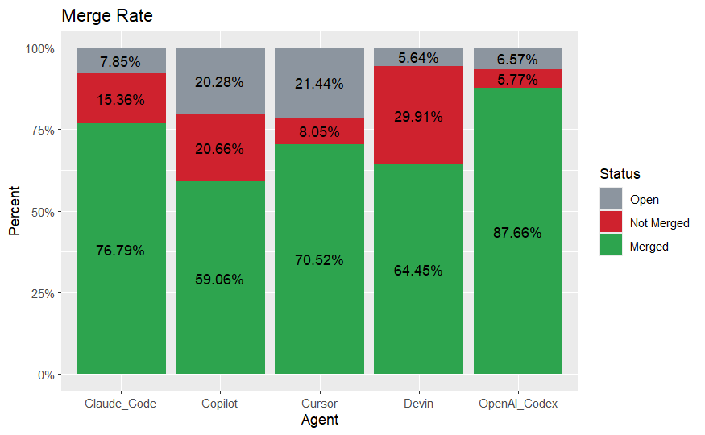
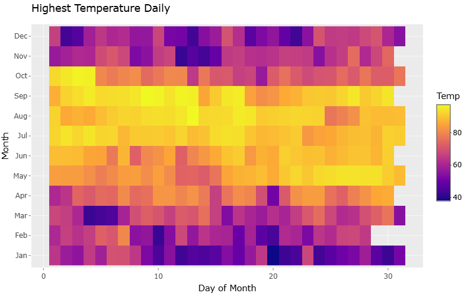

# Data Visualization and Reproducible Research

> Alexander Go

The following is a sample of products created during the _"Data Visualization and Reproducible Research"_ course.

## Project 01

In the `project_01/` folder you can find an analysis project 
exploring pull request data from the AI Dev all_pull_request dataset.
This project examines AI agent activity, merge success, and overall performance.

**Sample data visualization:** 

## Project 02

In this project, I explored daily weather data from the atl-weather dataset. 
This analysis temperature, humidity and other weather conditions over a one year period.

**Sample data visualization:** 

## Project 03

In this project, I explored methods to create different types of data visualizations.

**Sample data visualization:** 

### Moving Forward

Through these projects I learned how to design clear and effective visualizations.
Design, clarity, and storytelling are important elements in creating
visualizations that engages the viewer and helps bring your point across.
Additionally I learned how to produce reproducible workflows and
how to organize and share analysis. I plan to explore more interactive visualizations and improve my ability to tell 
stories with data.